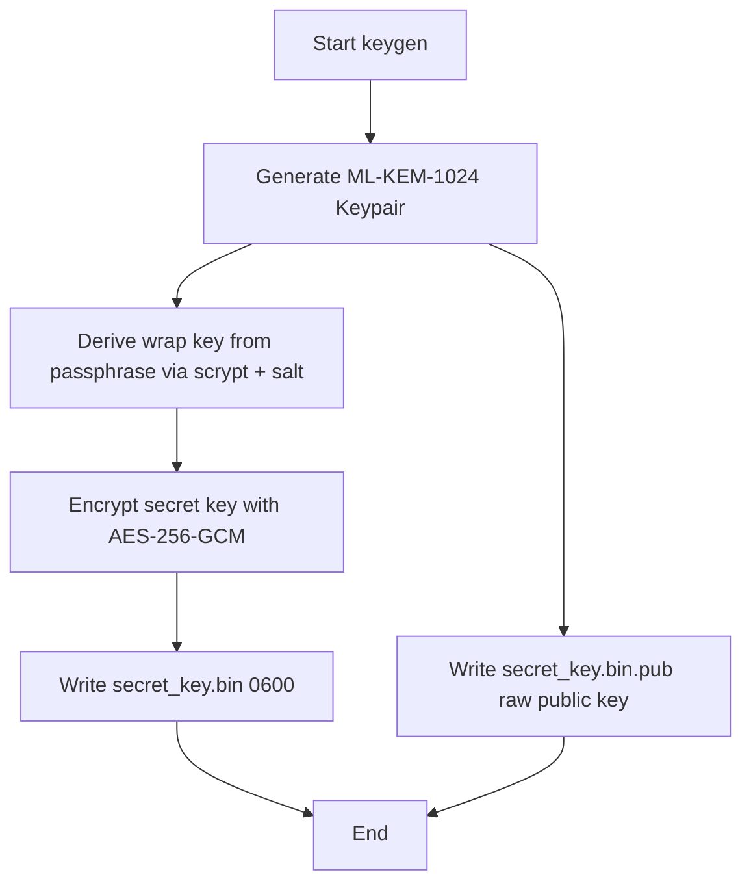
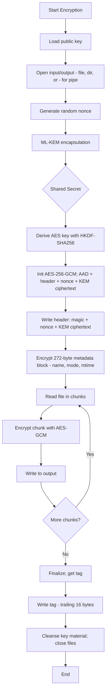
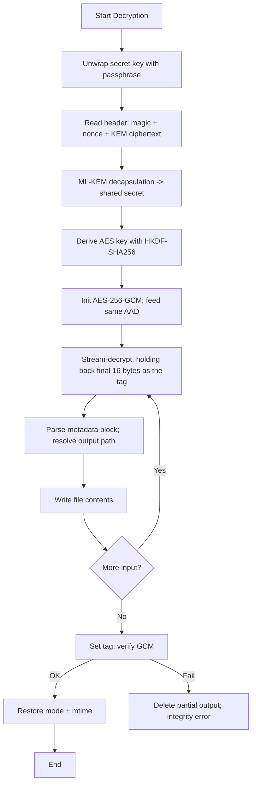

# Qsafe 5.0 Flow

## Key generation (`qsafe keygen`, run once)

```mermaid
graph TD
    A[Start keygen] --> B[Generate ML-KEM-1024 Keypair]
    B --> C[Derive wrap key from passphrase via scrypt + salt]
    C --> D[Encrypt secret key with AES-256-GCM]
    D --> E[Write secret_key.bin 0600]
    B --> F[Write secret_key.bin.pub raw public key]
    E --> G[End]
    F --> G
```

## Encryption (`qsafe encrypt`, no passphrase)

```mermaid
graph TD
    A[Start Encryption] --> B[Load public key]
    B --> C[Open input/output - file, dir, or - for pipe]
    C --> D[Generate random nonce]
    D --> E[ML-KEM encapsulation]
    E --> F{Shared Secret}
    F --> G[Derive AES key with HKDF-SHA256]
    G --> H[Init AES-256-GCM; AAD = header + nonce + KEM ciphertext]
    H --> I[Write header: magic + nonce + KEM ciphertext]
    I --> J[Encrypt 272-byte metadata block - name, mode, mtime]
    J --> K[Read file in chunks]
    K --> L[Encrypt chunk with AES-GCM]
    L --> M[Write to output]
    M --> N{More chunks?}
    N -->|Yes| K
    N -->|No| O[Finalize; get tag]
    O --> P[Write tag - trailing 16 bytes]
    P --> Q[Cleanse key material; close files]
    Q --> R[End]
```

## Decryption (`qsafe decrypt`, needs passphrase)

```mermaid
graph TD
    A[Start Decryption] --> B[Unwrap secret key with passphrase]
    B --> C[Read header: magic + nonce + KEM ciphertext]
    C --> D[ML-KEM decapsulation -> shared secret]
    D --> E[Derive AES key with HKDF-SHA256]
    E --> F[Init AES-256-GCM; feed same AAD]
    F --> G[Stream-decrypt, holding back final 16 bytes as the tag]
    G --> H[Parse metadata block; resolve output path]
    H --> I[Write file contents]
    I --> J{More input?}
    J -->|Yes| G
    J -->|No| K[Set tag; verify GCM]
    K -->|OK| L[Restore mode + mtime]
    K -->|Fail| M[Delete partial output; integrity error]
    L --> N[End]
```
